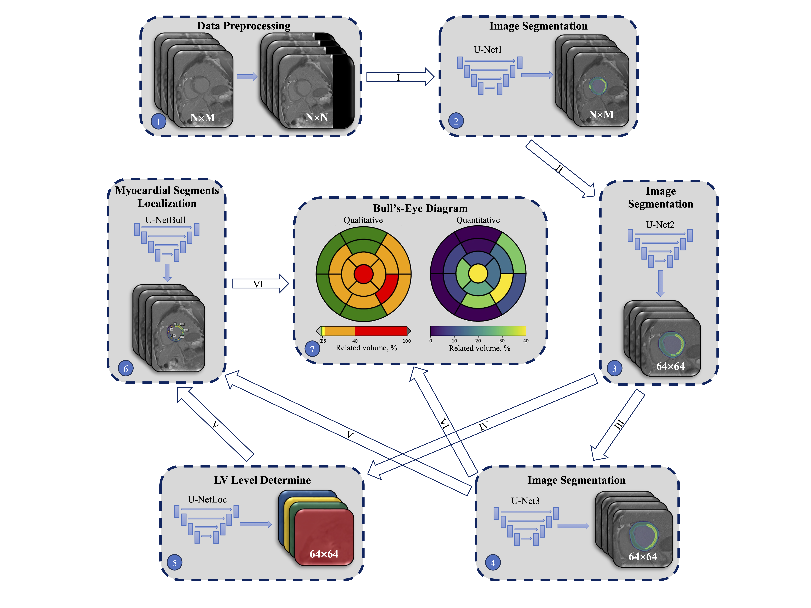

# CardioCascadeUnet v1.2: 

CardioCascadeUnet framework is destined for training and inference of the 
cascade architecture based on U-Net for the tasks of segmentation and 
localization of myocardial scar in LGE magnetic resonance images of the 
heart.

*******************************************************************************
## Requirements
pip install -r requirements.txt

Also training and inference of networks was tested on macOS Sonoma, M1 cpu with 
pytorch with mps technology support

macOS-14.6.1-arm64-arm-64bit
python version: 3.9.16 (main, Mar  8 2023, 04:29:24) 
torch version: 2.0.0
numpy version: 1.24.2

*******************************************************************************
# Neural Networks
## UNET1
- In MetaParameters class use UNET1 = True for training or prediction 
with default KERNEL (192x192 pixels). It is used to find the center of mass of 
the heart.

## UNET2
- The second model uses a cropped matrix of 64x64 pixels to improve scar 
and myocardium tissue segmentation.

## UNET3
- The third model uses a cropped matrix of 64x64 pixels with the removal 
of information from the image outside the gap (default is 8 pixels), to improve 
scar and myocardial tissue segmentation in the apical slices.

## UNET4
- It used to identify the level of the myocardium in each slice (basal, 
medial, apical, apex). 

## UNET5
- The last model, which divided the myocardium into 17 segments. 

*******************************************************************************
## Functions of Python scripts

- configurarion.py:	 Main list of options used to train the network.

- trainig_run.py:	Runs train of network. And it can be used to switch and 
choose a model configuration.

- validation_run.py:	

- inference_run.py:	It launches the inference of all images in the 
./Dataset/PROJECT_NAME_origin_new directory.

- comparing_run.py:	It launches a comparison of the predicted and reference
masks.

*******************************************************************************
*******************************************************************************
## Run modules

From root project directory run necessary modules:
	
 	.
	├── MainProject
	|   ├── main.py
	|   ├── CardioCascadeNet

main.py:

 	import CardioCascadeNet
 
	if __name__ == "__main__":
	    CardioCascadeNet.TrainRun().rewrite_weights_run()
	    CardioCascadeNet.TrainRun().train_run()
	    CardioCascadeNet.InferenceRun().run_process()
	    CardioCascadeNet.ComparingRun().comparing_run()
	    CardioCascadeNet.CountRelvolumeRun().count_rel_volume_run()
	    CardioCascadeNet.ValidationRun().validation_run()
*******************************************************************************
### Directories structure:

Data directories should have a similar structure:

	├── MainProject
 	|   ├── main.py
	|   ├── CardioCascadeNet
	|   ├── Dataset
	|   |   ├── PROJ_NAME_images
	|   |   |   ├── image_01.nii
	|   |   |   └── image_02.nii
	|   |   |   ├── image_03.nii
	|   |   |   └── image_04.nii
	|	|   |
	|   |   ├── PROJ_NAME_masks
	|   |   |   ├── mask_01.nii
	|   |   |   └── mask_02.nii
	|   |   |   ├── mask_03.nii
	|   |   |   └── mask_04.nii
	|	|   |
	|   |   ├── PROJ_NAME_images_new
	|   |   |   ├── mask_05.nii
	|   |   |   └── mask_06.nii
	|   |   |   ├── mask_07.nii
	|   |   |   └── mask_08.nii
	
### Training:

### Inference:
 - You can launch inference_run.py for testing cascade network on a new image

